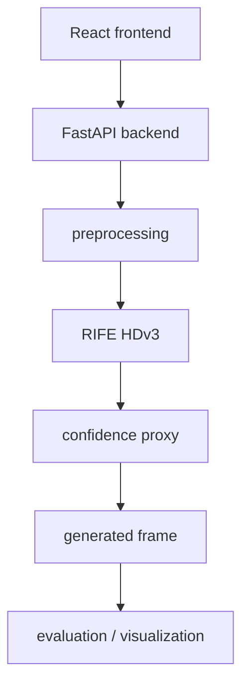
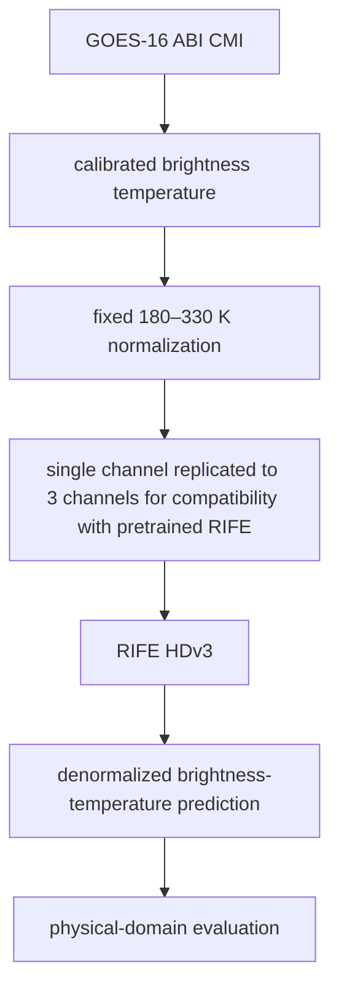

# FrameFlow

AI-powered temporal frame interpolation for satellite imagery using pretrained RIFE, with confidence visualization and quantitative evaluation.

FrameFlow takes two observations:

    T0 + T2
       ↓
    RIFE HDv3
       ↓
    Intermediate Frame (T1 ≈ T0.5)
       ↓
    Confidence Proxy
       ↓
    Quantitative Evaluation

## 1. Overview

Satellites observe the Earth at discrete time intervals, which can leave temporal gaps between observations. FrameFlow investigates whether pretrained video frame-interpolation techniques can reconstruct an intermediate satellite observation from two surrounding observations.

The system uses pretrained RIFE HDv3 to estimate the visual transformation between two satellite frames. It is evaluated on GOES-16 imagery using both RGB composites and calibrated ABI Band 13 infrared observations.

The goal is to demonstrate whether temporal interpolation can provide useful intermediate imagery for applications such as weather-system monitoring, satellite-data analysis, and disaster-response research.

FrameFlow is a research prototype, not an operational weather forecasting or disaster-warning system.

## Why It Matters

Satellite observations are valuable for monitoring rapidly changing weather systems, but observations are separated by time. FrameFlow explores whether the information between two observations can be reconstructed using deep-learning-based frame interpolation.

A successful system could provide a more continuous visual representation of evolving cloud and storm structures without requiring an additional satellite observation.

Potential applications include:

- More continuous monitoring of rapidly evolving weather systems
- Visualization of storm and cloud evolution
- Supporting satellite-data analysis and research
- Providing additional temporal context for disaster-response analysts

These are potential applications. The current prototype demonstrates interpolation capability rather than operational decision-making.

## 2. Key Features

- RIFE HDv3 temporal interpolation
- Learned optical-flow-based frame interpolation
- PyTorch/CUDA inference
- CPU fallback
- Satellite image preprocessing
- GOES-16 RGB evaluation
- GOES-16 ABI Band 13 evaluation
- Interpolation confidence proxy
- MAE/RMSE/PSNR/SSIM evaluation
- Linear interpolation baseline
- FastAPI backend
- React/Vite frontend
- Browser E2E testing
- Evaluation artifacts
- Reproducible evaluation reports

## 3. System Architecture



**Band-13 Thermodynamic Pipeline:**


*(Explicitly, RIFE's architecture was NOT modified).*

## 4. Repository Structure

```text
FrameFlow/
├── backend/
├── data/
├── docs/
├── frontend/
├── ml/
├── models/
├── outputs/
├── tests/
├── implementation_plan.md
├── task.md
├── requirements.txt
└── README.md
```

Large datasets, model weights and generated outputs are intentionally excluded through `.gitignore`.

## 5. Environment

Verified environment specifications:
- Python 3.12.10
- PyTorch 2.5.1+cu121
- CUDA available
- NVIDIA GeForce RTX 4070 Laptop GPU

*(CPU fallback engages automatically when CUDA is unsupported).*

*(Node/npm versions dynamically mapped through the frontend execution).*

## 6. Installation

Clone:
```bash
git clone <repository-url>
cd FrameFlowV1
```

Python virtual environment:
```bash
python -m venv .venv
.\.venv\Scripts\activate   # For Windows
# source .venv/bin/activate # For Linux/Mac
```

Dependency installation:
```bash
pip install -r requirements.txt
```

RIFE model weights placement:
Place downloaded weights into `models/rife/`. Model weights are excluded from Git. See `docs/REPRODUCIBILITY.md`.

Frontend dependency installation:
```bash
cd frontend
npm install
cd ..
```

## 7. Running the Application

Backend:
```bash
.\.venv\Scripts\python -m uvicorn backend.main:app --port 8000
```

Frontend:
```bash
cd frontend
npm run dev
```

Workflow configuration:
1. upload Frame T0
2. upload Frame T2
3. choose timestep
4. generate intermediate frame
5. inspect confidence proxy
6. view output

## 8. API

Reference: `docs/API.md`

| Method | Path | Purpose | Required Inputs | Response Structure |
| :--- | :--- | :--- | :--- | :--- |
| **GET** | `/health` | Check configuration state | None | Server and CUDA status |
| **GET** | `/model/info` | RIFE model details | None | Device and model variants |
| **POST**| `/interpolate` | Generate intermediate frame | `frame0`, `frame1`, `timestep` | Generated and confidence map URLs |
| **POST**| `/evaluate` | Scientific quantitative evaluation | `frame0`, `ground_truth`, `frame2` | MAE, RMSE, PSNR, SSIM comparisons |

## 9. Evaluation Methodology

Core experiment:
```text
    T0 + T2
       ↓
    RIFE
       ↓
    predicted T1
       ↓
    compare with actual T1
```

Baseline:
```text
    T0 + T2
       ↓
    linear interpolation
       ↓
    predicted T1
       ↓
    compare with actual T1
```

Metrics:
- MAE (lower is better)
- RMSE (lower is better)
- PSNR (higher is better)
- SSIM (higher is better)

## 10. Real GOES RGB Validation

Dataset: GOES-East / GOES-16 (Hurricane Ian)

These are 10 non-overlapping temporal samples from **ONE** Hurricane Ian temporal event.

Validated aggregate:

**RIFE:**
- MAE: 8.598
- PSNR: 24.840 dB
- SSIM: 0.8109

**Linear:**
- MAE: 17.748
- PSNR: 19.533 dB
- SSIM: 0.6810

RIFE outperformed linear interpolation on all 10 non-overlapping samples.

*Limitation*: These samples come from one temporal event and therefore do not establish cross-event generalization.

## 11. GOES-16 ABI Band 13

- Product: GOES-16 ABI Level-2 CMIP
- Variable: CMI
- Units: Kelvin
- Band: 13
- Native dimensions: 1500 × 2500
- Evaluated crop: 512 × 512
- Crop: rows 500:1012, columns 1000:1512

`_FillValue = -1` is masked explicitly during evaluation to secure valid geometric boundaries.

**Normalization:**
- 180 K → 330 K
- fixed evaluation range = 150 K

**RIFE Compatibility Transformation:**
```text
    Band 13 single-channel normalized field
             ↓
    replicate to 3 channels
             ↓
    pretrained RIFE HDv3
             ↓
    take one output channel
             ↓
    denormalize back to Kelvin
```
*(This does not modify the RIFE architecture. Channel replication adds no additional information).*

Validated Band 13 Result:

**RIFE:**
- MAE: 0.358 K
- RMSE: 0.766 K
- PSNR: 45.836 dB
- SSIM: 0.9925

**Linear:**
- MAE: 1.688 K
- RMSE: 4.544 K
- PSNR: 30.373 dB
- SSIM: 0.8735

*(This represents Band-13 brightness-temperature reconstruction MAE tested within the evaluated Hurricane Ian crop. It does not predict near-surface atmospheric temperature accuracy).*

## 12. Confidence

**Interpolation Confidence Proxy**
This serves strictly as a structural consistency estimate derived from the interpolation/warping reconstruction behavior.

Reference: `docs/CONFIDENCE_METHOD.md`

## 13. Performance

Model/kernel inference time natively isolates from total API/browser processing latency. Hardware constraints bind prediction latency independently.

## 14. Testing

Framework verification natively handled via:
- `pytest`
- backend tests
- frontend build (`npm run build`)
- browser E2E visual verifications.

## 15. Data and Model Weights

Large files are intentionally excluded from Git:
```text
data/satellite/raw/
data/satellite/validation/
*.nc
*.gif
*.mp4
models/rife/
outputs/
```
Reference `docs/REPRODUCIBILITY.md` for explicit acquisition links natively covering dataset components.

## 16. Reproducibility

For reproducibility, see `docs/REPRODUCIBILITY.md`.

## 17. Limitations

- validation has limited event diversity
- current Band 13 experiment uses a 512×512 crop
- pretrained RIFE has not been fine-tuned for satellite imagery
- confidence is a proxy, not calibrated probability
- RGB and Band 13 metric values should not be compared directly
- current validation does not establish operational forecasting
- current experiments do not establish cross-event generalization
- The current results demonstrate feasibility of satellite temporal interpolation; they do not establish operational meteorological performance.

## 18. Roadmap

- [x] RIFE integration
- [x] preprocessing
- [x] confidence proxy
- [x] evaluation pipeline
- [x] FastAPI backend
- [x] React dashboard
- [x] browser E2E
- [x] real GOES RGB validation
- [x] GOES Band-13 prototype
- [ ] cross-event Band-13 validation
- [ ] satellite-specific fine-tuning
- [ ] pretrained vs fine-tuned comparison

## 19. Project Status

Current status: Research prototype demonstrating the feasibility of satellite temporal frame interpolation.

## 20. Citation / References

Huang, Z., Zhang, T., Heng, W., Shi, B., & Zhou, S. (2022). Real-Time Intermediate Flow Estimation for Video Frame Interpolation. In Proceedings of the European Conference on Computer Vision (ECCV).

## 21. License

License not yet specified.

For reproducibility, see `docs/REPRODUCIBILITY.md`.
